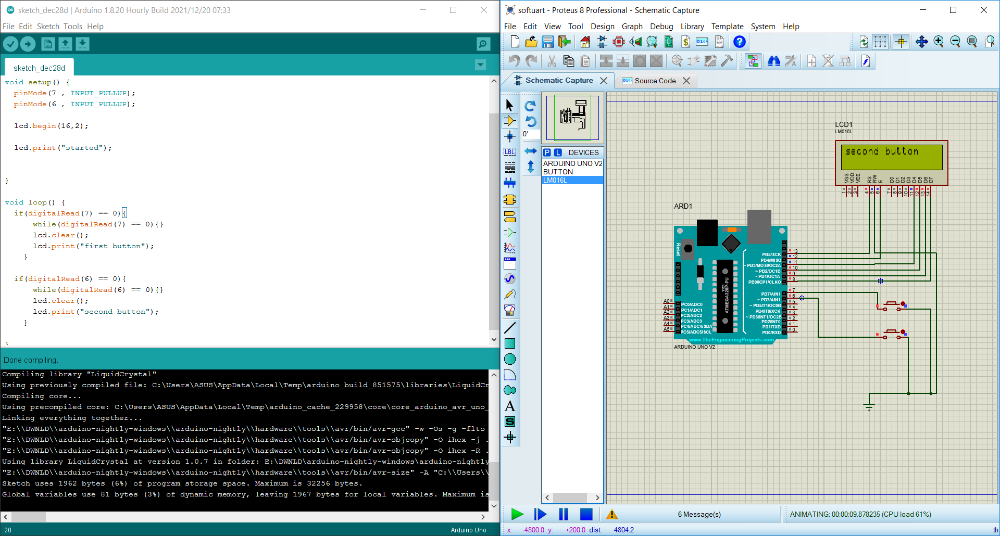
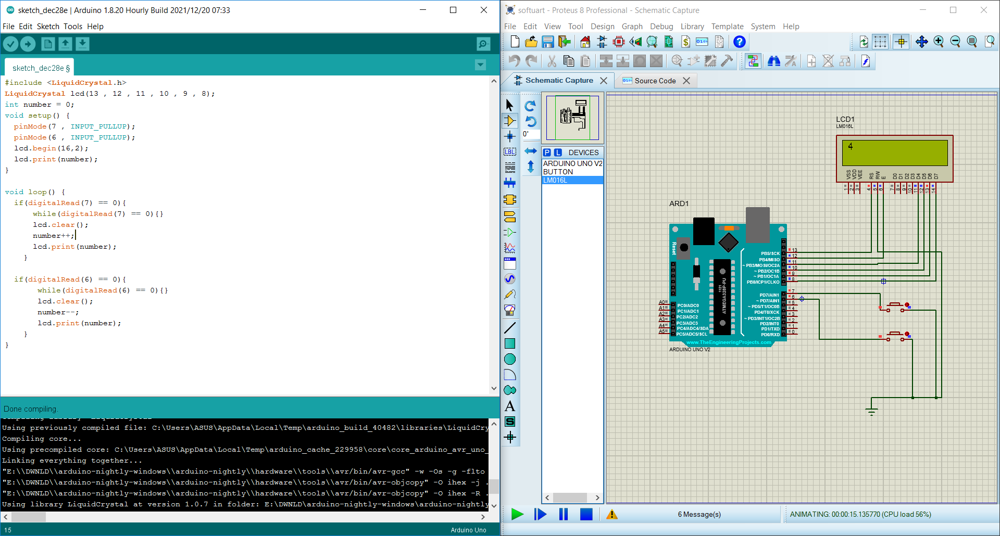
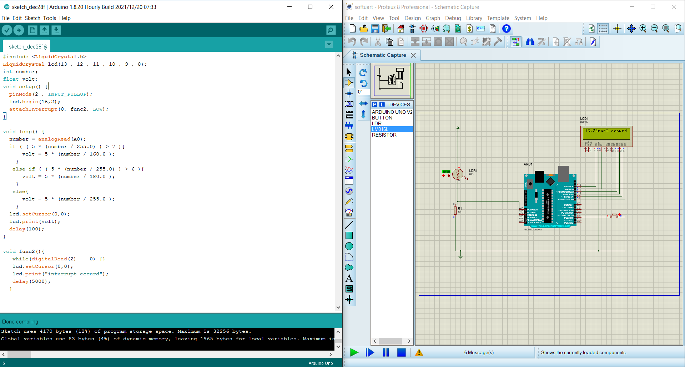

# Arduino Projects with Proteus 8

Welcome to a collection of small Arduino projects simulated using Proteus 8. These projects demonstrate various functionalities and are designed to help you get started with Arduino and Proteus simulations. Below are brief descriptions of each project along with pictures of their outputs.

## Projects

### 1. LCD Display

Description: A basic project showcasing how to display text on a 16x2 LCD screen.

### 2. Advanced LCD Display

Description: Expanding upon the previous project, this one demonstrates more advanced LCD features.

### 3. LDR-LCD

Description: This project combines a Light-Dependent Resistor (LDR) with an LCD to display light intensity.

### 4. Motor and LED

Description: Control a motor and an LED using Arduino.

### 5. Periodic Motor

Description: Create a project that runs a motor periodically.

### 6. Traffic Light

Description: Simulate a traffic light control system using LEDs.

## Usage

Each project folder contains the Arduino code and the corresponding Proteus simulation files for your reference.

## License

This project is licensed under the MIT license. For more information, please refer to the license file.

---

Feel free to explore the individual project folders, contribute to the projects, or adapt them to your specific Arduino and Proteus simulations!
